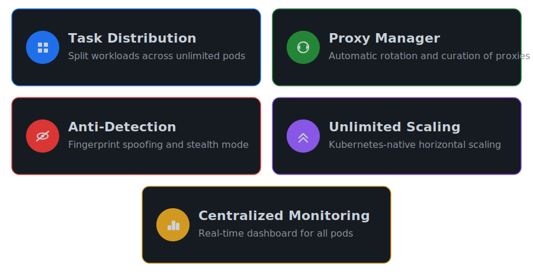

<div align="center">

<a id="logo" href="#logo"></a>


# Armada

### Scale Your Bots & Scrapers. Effortlessly.


&nbsp;&nbsp;<a href="https://armada.services/docs"></a>


**Write once, deploy in seconds. Let the orchestrator handle the rest.** 
<br>
<sub>*⇨ See the full documentation [here](https://armada.services/docs)*</sub>


</div>

<div align="center">
<a href="#diagram-deploy"></a>
</figure>
</div>


## Demo


https://github.com/user-attachments/assets/ee036800-08fe-45e1-aec5-141cc3bffcf6


## First Try — reproduce the demo above on a Minikube Cluster

*For a proper Quick-start on a real K8s cluser, see [Quick Start - Installation Guide](https://armada.services/docs/getting-started/quickstart-kubernetes/).*

**Requirements** : Linux, Python, Azure SQL Database instance, Docker, Kubernetes on Minikube (local) with Kubectl and Helm


### 1. Expose the testing first-try-website locally with Docker

```bash
cd first-try/first-try-website
docker build -t twittor .
docker run -p 5010:5010 twittor
cd ../..

```
The App becomes accessible at http://localhost:5010 (or http://host.minikube.internal:5010 in Minikube)
### 2. Complete .env with mandatory values


```dotenv
SQL_SERVER_USER=your_user
SQL_SERVER_PASSWORD=your_password
SQL_SERVER_DB=your_database
SQL_SERVER_NAME=your_server.database.windows.net
DOCKER_HUB_USERNAME=armadasvc
```

*See [Environment Variables](https://armada.services/docs/reference/architecture/environment-variables/) for the complete reference.*

### 3. Bootstrap resources

```bash
cd bootstrap
pip install -r requirements.txt
python bootstrap_database.py
python bootstrap_secrets.py
python bootstrap_cluster_resources.py
cd ..
```


Select option 3. *See [Bootstrap Scripts](https://armada.services/docs/reference/architecture/bootstrap-scripts/) for details.*

### 4. Create your first project using first-try mode

```bash
bash create-project.sh
```
and **choose option 2. First Try project**, and choose a directory where you want to store the project folder. 
*Note : Python, JSON, and CSV files are ready to run, no manual modif required for first-try (configuration: 10 messages across 3 agents).*

For production project setup and create your own project. *See [Setting Up a Project](https://armada.services/docs/setting-up-project/) for JSON, CSV, and Python file configuration for more details.*

### 5. Launch and monitor

In **Launch** Tab, open Armada Dashboard : 

```bash
kubectl port-forward svc/armada-frontend 8080:8080
```

Drag and drop your first-try-project folder and click Launch

Switch to **Monitor** tab to watch your run in real time

*Note : without any pre-existing cache (for example, on the very first run of Aramada), there will be a cold start caused by the cluster spin-up, as it provisions heavy resources (such as browser), so it is normal to see `Ǹo Jobs` for a while in Jobs Monitoring Tab*

##  Under the Hood

### 1. A Batteries-Included Service Ecosystem

Armada ships with a full suite of dedicated microservices that agents can leverage out of the box. A Proxy Service selects, rotates and   curates proxies, while a Fingerprint Service fetches and repackages browser fingerprint tokens — both backed by a shared SQL Server. The Orchestrator sits at the center, coordinating everything, and a Monitoring Service feeds real-time job and event data down to a live Dashboard for full observability. *See [Architecture Overview](https://armada.services/docs/reference/architecture/overview/) and [Services Reference](https://armada.services/docs/reference/services/).*

<p id="diagram-arch" align="center">
  <a href="#diagram-arch"></a>
</p>

### 2. A Simple Yet Powerful Input Pipeline
The Armada Orchestrator ingests three user-provided inputs : arbitrary Python code for automation logic, a central JSON configuration for infrastructure and agent/job defaults, and optional CSV files for fine-grained per-agent or per-job overrides. Then, it merges them together into fully resolved, executable tasks that are distributed to Kubernetes pods. *See [Configuration Pipeline](https://armada.services/docs/reference/architecture/configuration-pipeline/).*

<p id="diagram-config" align="center">
  <a href="#diagram-config"></a>
</p>

### 3. Built-In Scale-Out Distribution

Scaling from one to hundreds of workers requires zero changes to your code. The Orchestrator handles the heavy lifting: it first seeds each pod with its own tailored configuration via Redis, then floods a RabbitMQ queue with jobs that pods consume on demand — faster workers naturally pick up more tasks, ensuring optimal throughput. *See [Run Lifecycle](https://armada.services/docs/reference/architecture/run-lifecycle/).*

<p id="diagram-queue" align="center">
  <a href="#diagram-queue"></a>
</p>

## Key Features

<p id="key-features" align="center">
  <a href="#key-features"></a>
</p>

## Supported Drivers & Introducing Fantomas

<p align="center">
  
</p>


### Fantomas 
**Fantomas is Armada's in-house browser automation library, built on top of nodriver and purpose-built to run inside agent pods.**

- Human emulation out of the box. Every click follows a physics-based curved trajectory (WindMouse), and every keystroke is typed with randomized delays — no teleporting cursors or instant text injection.
- Two interaction strategies. Native mode operates through Chrome's CDP protocol with emulation layers on top. XDO mode goes deeper, firing events at the OS level via xdotool, making them virtually indistinguishable from real user input.
- Seamless Armada integration. Fantomas is designed around Armada's two-tier lifecycle: a browser instance is launched once at the agent level and reused across all jobs, avoiding the cost of spinning up Chrome for every single task. Move it to the job context instead if you needm full isolation between tasks.
- Full nodriver compatibility. Every native nodriver method (get, query_selector, tabs, ...)
remains directly available — Fantomas extends the API without replacing it. *See [Fantomas Documentation](https://armada.services/docs/fantomas/) and [API Reference](https://armada.services/docs/fantomas/fantomas-reference/).*

<p id="fantomasdoc" align="center">
  <a href="#fantomasdoc"></a>
</p>

## Documentation

For detailed guides, API reference, and advanced configuration, visit the **[Full Documentation](https://armada.services/docs)**.

## Initial Public Release 

We are starting with a clean Git history for this first public release (0.9.0), aligning the project with a fresh SemVer strategy and avoiding exposure of legacy commits or releases that no longer reflect the current state of the codebase.

## Contributing

Please read [CONTRIBUTING.md](CONTRIBUTING.md) before submitting a pull request.

## Code of Conduct

This project follows the guidelines defined in [CODE_OF_CONDUCT.md](CODE_OF_CONDUCT.md).

## License

See [LICENSE](LICENSE) for details.
